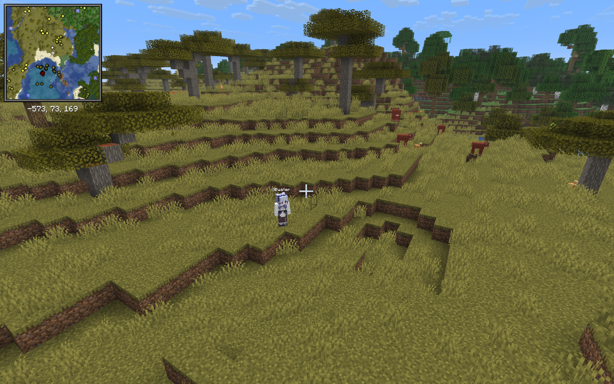
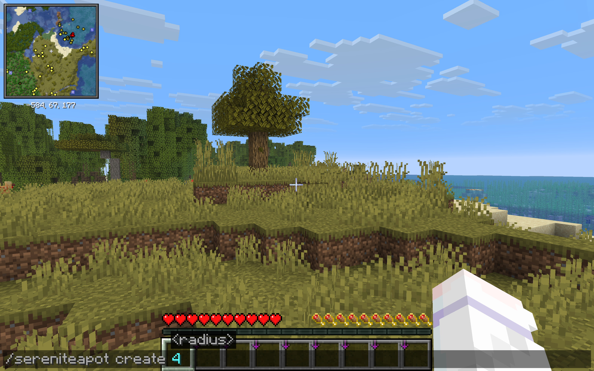
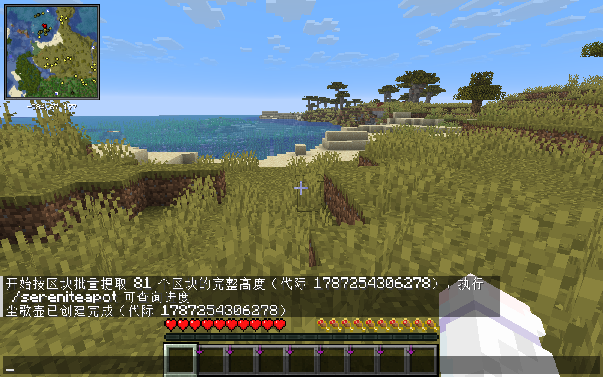
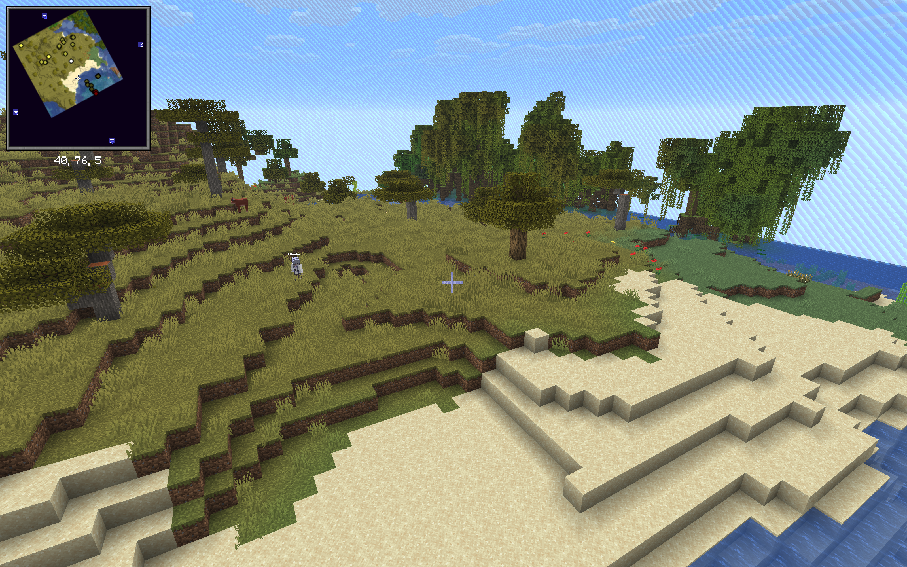
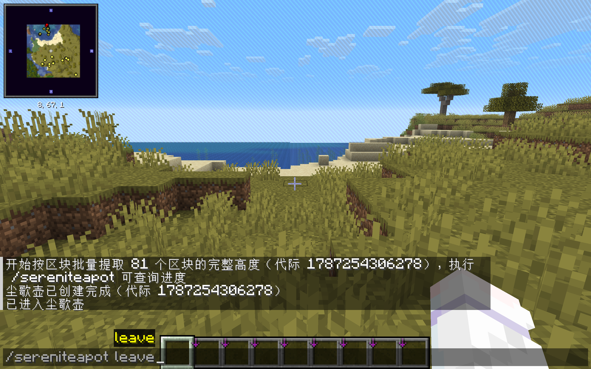
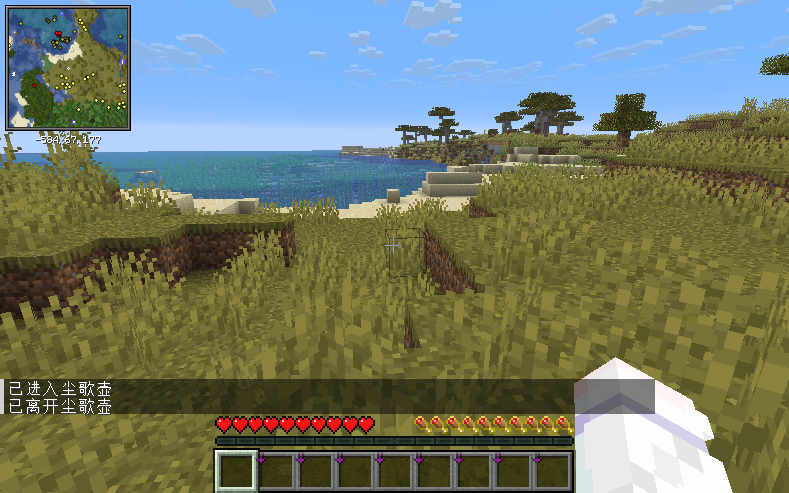

<p align="center">
  
</p>

<h1 align="center">尘歌壶（Serenitea Pot）</h1>

<p align="center">
  <a href="README.md">English</a> | <strong>简体中文</strong>
</p>

Minecraft 26.2 的 Fabric 服务端尘歌壶模组，支持独立服务器和单人游戏的集成服务器。每名玩家拥有一组三维度尘歌壶（主世界、下界、末地），使用服务器现有的模组、注册表与游戏逻辑，同时隔离世界存档和玩家创造状态。联机时只需安装在服务端，客户端无需安装。

## 环境要求

| 组件 | 版本 |
| --- | --- |
| Minecraft | 26.2 |
| Java | 25 |
| Fabric Loader | 0.19.3 或更高 |
| Fabric API | 0.158.0+26.2 |
| Fabric Language Kotlin | 1.13.12+kotlin.2.4.0 或更高 |

Arcade Dimensions `0.13.0-beta.6+26.2`、其相关模块以及 Fabric Permissions API v0 `0.7.0` 已嵌入最终 JAR，不需要另外安装，也不应从产物中移除。

当前快照版本：`1.0.0-snapshot.1-26.2`

## 安装

1. 在服务端安装 Minecraft 26.2 和 Fabric Loader 0.19.3 或更高版本。
2. 从 [GitHub Releases](https://github.com/water2004/serenitea-pot/releases) 下载 `serenitea-pot-1.0.0-snapshot.1-26.2.jar`。
3. 下载 Fabric API `0.158.0+26.2`，以及 Fabric Language Kotlin `1.13.12+kotlin.2.4.0` 或更高版本。
4. 将三个 JAR 放入服务端 `mods` 目录，并使用 Java 25 启动服务器。

尘歌壶没有客户端组件，也不需要单独的配置文件；所有限制通过游戏内 OP4 管理命令设置。Arcade Dimensions 已嵌入尘歌壶 JAR，不能重复安装。

## 核心规则

- `/sereniteapot create <radius>` 以玩家当前所在区块为中心，按区块半径提取完整维度高度；X/Z 每边为 `2 × radius + 1` 个完整区块。半径 `0` 表示当前 1 个区块，半径 `1` 表示 `3 × 3` 个区块。
- 区域严格按区块边界对齐。主世界高度边界为 `[-64, 320)`（实际方块 Y=-64…319），下界和末地使用各自维度的完整构建高度。
- 尘歌壶使用独立局部坐标系：每次提取都会把源中心区块映射为尘歌壶的 `(0, 0)` 区块，三个维度不继承公共世界的绝对 X/Z，因此传送门只在同一尘歌壶的局部坐标之间换算。为完整覆盖中心区块，世界边界的几何中心是该区块中心 `(8, 8)`。
- 从公共主世界、下界或末地创建时，只替换尘歌壶中对应维度；另两个维度通过新代际复制保留。
- 新代际完整保存后才切换活动指针，提交后立即删除本次刚被替换的旧代际，不保留隐式备份。启动时不会扫描、迁移或清理旧格式数据。
- 早期测试构建中按公共世界绝对坐标生成的尘歌壶不会自动重定位；更新到局部坐标构建后应删除并重新提取。
- 复制在服务端主线程按预算分片执行，不并发调用模组世界代码。复制任务和尘歌壶 tick 消耗同一套玩家/全局性能预算。
- 尘歌壶外部使用 void 生成器，并为每个已有维度设置世界边界。
- 进入任意尘歌壶后使用该尘歌壶独立的创造状态；离开后恢复公共世界的库存、末影箱、经验、生命、效果、重生点、上次死亡位置、能力和游戏模式。
- 只有真实主人本人在自己的尘歌壶中时，整组三维度才加载。主人离开或下线后立即保存、卸载，并送出所有访客和管理员。
- Carpet 假玩家、地狱门加载器、区块票和机器不能维持尘歌壶加载。
- 普通玩家提交 60 秒一次性申请；主人可直接点击聊天中的“接受 / 拒绝”，按钮携带本次申请的唯一标识，旧按钮不能批准新申请。OP4 无需申请，但同样要求主人在场。
- 主人仅在自己尘歌壶内获得等价于 `worldedit.*` 和 `axiom.all` 的完整建造工具权限；壶外、其他玩家的壶内以及访客的既有授权均不改变。
- 所有尘歌壶维度都会阻止方块命令方块和命令方块矿车执行，公共世界中的命令方块保持服务器原有行为。
- 删除是永久操作，不创建备份。

## 玩家命令

```text
/sereniteapot                         查看自己的状态
/sereniteapot create <radius>         按区块半径提取当前维度完整高度，覆盖对应尘歌壶维度
/sereniteapot enter                   进入自己的尘歌壶
/sereniteapot leave                   离开当前尘歌壶
/sereniteapot unfreeze                维修完成后恢复自己的尘歌壶 tick
/sereniteapot request <owner>         申请进入，60 秒过期
/sereniteapot requests                查看收到的待处理申请
/sereniteapot approve <player>        批准并立即送入申请者
/sereniteapot deny <player>           拒绝申请
/sereniteapot delete confirm          永久删除自己的尘歌壶
```

OP4 也可用 `/sereniteapot enter <owner>` 进入主人当前已加载的尘歌壶。

跨边界传送会为每名玩家分别保存公共世界和尘歌壶中的维度、精确坐标与朝向。离开时回到进入前的公共位置，下次进入时回到上次离开的尘歌壶位置；首次进入或保存位置已被裁边移除时才使用创建入口。玩家在尘歌壶内掉线时也会先执行同一条离开事务，再由 Vanilla 保存公共维度和公共坐标。

## OP4 管理命令

```text
/sereniteapot admin enable|disable <player>
/sereniteapot admin max-radius <player> <chunk-radius>
/sereniteapot admin budget <player> <ms-per-second>
/sereniteapot admin global-budget <ms-per-second>
/sereniteapot admin status <player>
/sereniteapot admin perf [player]
/sereniteapot admin delete <player> confirm
```

新玩家默认最大区块半径为 `4`；OP4 可用 `max-radius` 为每名玩家独立调整。这里的半径始终以区块为单位，绝对上限为 `256`。提高上限只更新配置；降低上限且现有维度更大时，会通过同一暂存代际事务裁掉所有已创建维度超出新半径的边缘，成功切换后删除原代际，而不是只缩世界边界。

`disable` 会禁止新进入，并在 tick 末尾通过关闭事务送出所有成员、确认维度无人占用，最后保存并卸载。`freeze` 是维修模式：仍允许主人、获批访客和管理员进入，但整组三维度的 `ServerLevel.tick` 都暂停，机器、实体、计划刻和随机刻不会推进；主人离开后仍照常卸载。运行中的尘歌壶异常卡顿时会自动进入 `frozen`，主人可以直接维修并自行 `unfreeze`；反复制造问题时 OP4 仍可 `disable`。

WorldEdit 通过当前安装版本实际采用的 Fabric 权限 API 获得按上下文计算的完整权限，Axiom 5.5 通过它实际使用的旧版 v0 API 获得 `axiom.all`。判断条件是玩家本人正处在自己名下的尘歌壶维度；离开后授权立即消失。在公共世界、别人的尘歌壶内或访客身份下，本模组返回“未决定”，继续由服务器原有的 OP、LuckPerms、WorldEdit 配置和 Axiom 权限作出结果。OP4 仍保持服务器原本赋予的权限。

## 性能模型

每名玩家的三个维度和全高度区域复制任务共享一个毫秒/秒 token bucket，全部尘歌壶还共享一个全局池。预算不足、禁用、冻结或创建中时会跳过整个 `ServerLevel.tick`。区域复制按玩家轮转，方块、生物群系、计划刻和实体扫描都按区块推进，每次最多准备一个新区块，并受每 tick 4 ms 的额外总上限约束。`perf` 显示 `RUNNING`、`COPYING`、`THROTTLED`、`FROZEN`、`DISABLED` 等运行状态，并记录最近完整一秒的总耗时、其中复制耗时、平均/最大维度 tick、执行/跳过次数和有效 TPS。

单次维度 tick、同步区块加载或模组回调无法从中途安全终止；如果一次调用超过预算，实际耗时会形成 token 债务，后续工作被节流。只有已经运行的尘歌壶单次 `ServerLevel.tick` 达到 200 ms 才会自动冻结；玩家留在原地，从下一 tick 起进入维修模式。创建会直接克隆每个完整区块的 section palette，再单独复制方块实体、计划刻、实体、POI、光照、结构和 Fabric 持久化 chunk attachment，而不是逐方块写入。慢区块不会导致冻结或失败：超出的耗时记为预算债务，之后降低推进频率继续执行。

实体复制同样属于计划的一部分：每片最多收集 256 个非玩家根实体，单区块超过该数量时会留在当前区块继续分片收集，不会直接判定创建失败；乘客树随根实体整体复制。

## 模组兼容边界

产物内嵌并强依赖 Arcade Dimensions 0.13.0-beta.6。尘歌壶三维度由 `VanillaLikeLevelsBuilder` 组成；Arcade 的 Nether/End portal mixin 和 `VanillaDimensionMapper` 负责让玩家及实体只在同一名主人的主世界、下界、末地之间传送。不要从 jar 中移除或替换这组 Arcade 依赖。

尘歌壶（Serenitea Pot）的实现源码全部使用 Java 25。Arcade Dimensions 自身使用 Kotlin 编写，因此最终服务端产物仍声明 `fabric-language-kotlin` 运行时依赖；这不代表本项目还混有 Kotlin 业务源码，也不要求玩家客户端安装任何模组。

区域提取会复制方块状态、方块实体完整 NBT/Data Components、生物群系、方块/流体计划刻、非玩家实体（含乘客树）、POI、结构信息、光照和 Fabric 持久化 chunk attachments；复制管线管理的区块、方块实体位置、计划刻、实体位置、POI、结构和光照坐标会统一平移到局部坐标。因此把机器状态保存在方块实体或标准持久化 chunk attachment 中的常规模组通常可以直接工作；尘歌壶仍使用服务端相同的模组、注册表和游戏逻辑。

区域提取不是任意模组数据的字节级裁剪器。维度级 SavedData、跨区域网络、第三方私有存储，以及自定义 level/player attachments 没有通用且安全的区域语义，当前不会承诺复制或隔离。持久化 chunk attachment 会按模组注册的编解码器原样复制；若其私有负载另存了公共世界绝对坐标，通用 API 无法识别并改写。玩家隔离覆盖上文列出的原版状态；额外模组若把关键数据放在这类自定义存储中，需要该模组提供专用适配。

WorldEdit 与 Axiom 的接入只使用它们公开采用的权限接口，不向两个模组注入 mixin，也不改写其内部数据包或编辑逻辑。第三方模组仍需自行保证操作作用于它所认定的当前世界。

模组元数据声明的可选兼容范围是 WorldEdit `>=7.4.4-beta-01 <7.5.0` 和 Axiom `>=5.5.0 <5.6.0`，未安装它们不会影响尘歌壶启动。该范围覆盖 WorldEdit 为 Minecraft 26.2 发布的全部构建：7.4.4 Beta 1 与 7.4.4 使用旧版权限 API，7.4.5 改用 Fabric Permission API v1 并保留旧版回退。Axiom 从 5.0.0 才开始在 Fabric 端提供服务器权限，而 Minecraft 26.2 目前只发布了 5.5.0，因此约束有意只承诺已经核验的 5.5 系列。

## 截图

### 公共主世界

<p align="center">
  
</p>

### 提取区域

<p align="center">
  
</p>
<p align="center">
  
</p>

### 进入和离开尘歌壶

<p align="center">
  
</p>
<p align="center">
  
</p>
<p align="center">
  
</p>
<p align="center">
  
</p>

## 构建与验证

使用 IntelliJ IDEA 直接打开仓库根目录即可导入 Gradle 工程。源码位于 `src/main/java`，需要 Java 25：

```powershell
.\gradlew.bat clean check
```

`check` 会先运行纯 Java 的模型与持久化测试，再启动 Minecraft 26.2 专用 GameTest 服务器，加载 Fabric、Arcade、mixin 和本模组，并验证区块 section 及持久化 chunk attachment 的复制结果彼此独立。只需重跑服务端测试时可执行 `.\gradlew.bat runGameTest`。构建产物位于 `build/libs/`。
